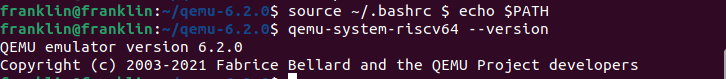
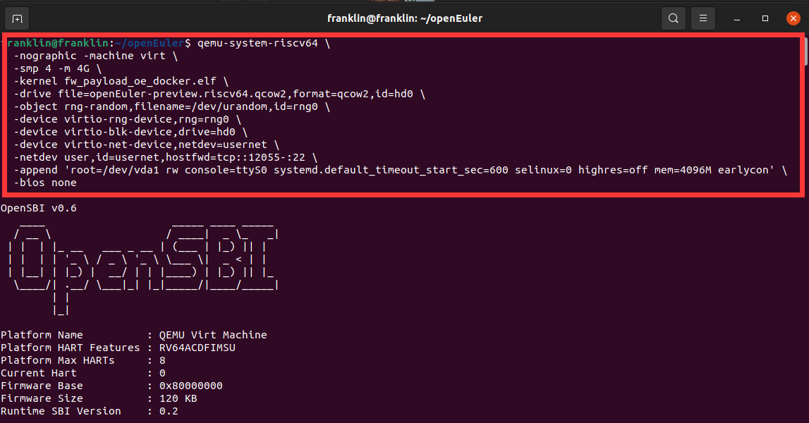
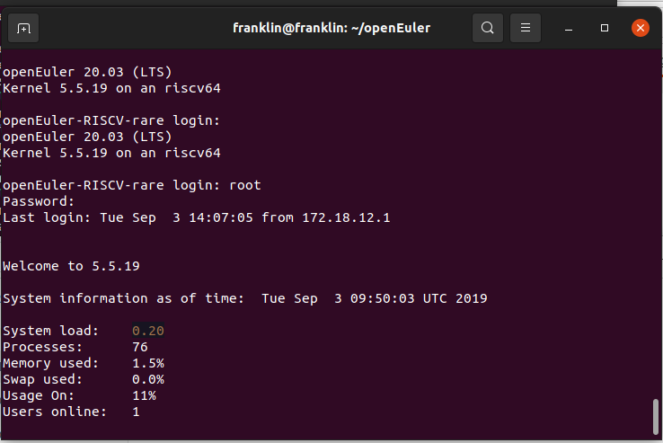
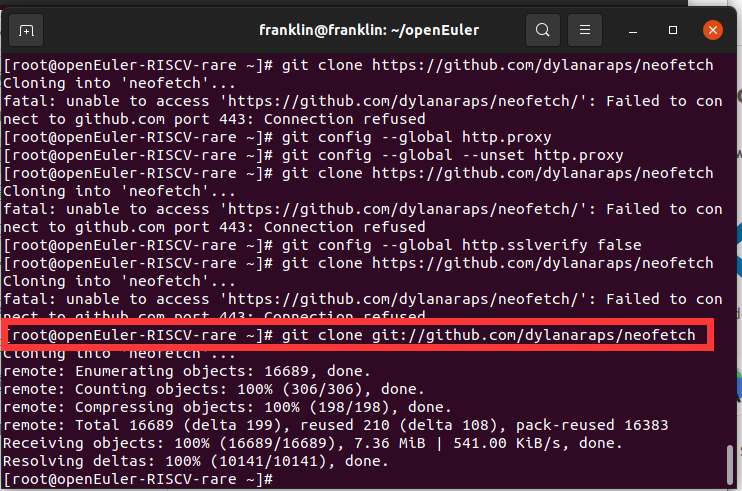
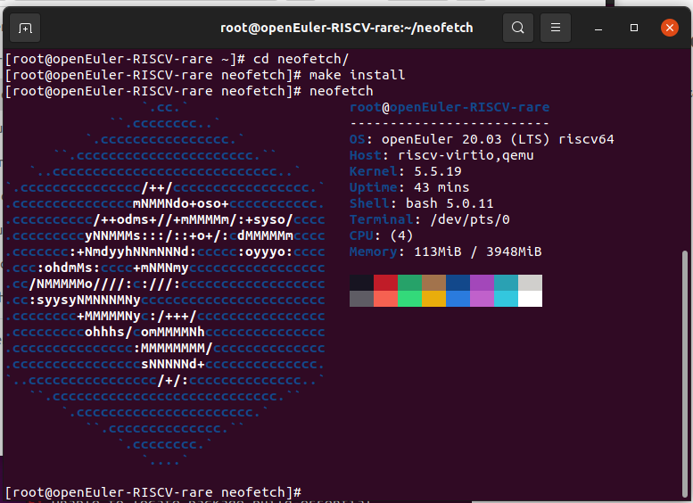

# Open-Euler-
最近在学习使用Open Euler，记录一下踩过的坑，欢迎大家一起讨论

# 更新ing

## 安装步骤：

1.  下载 QEMU 源代码并安装

    1.  \$ sudo apt install build-essential 安装必要的构建工具

    2.  \$ wget https://download.qemu.org/qemu-\<latest\>.tar.xz 下载最新 QEMU
        源码包，请将 \<latest\> 替换为目前最新的 QEMU 版本

    3.  \$ tar xvJf qemu-\<latest\>.tar.xz 解压刚刚下载的源码包

    4.  \$ cd qemu-\<latest\>

    5.  ./configure --target-list=riscv64-softmmu,riscv64-linux-user
        \--prefix=/home/xx/program/riscv64-qemu

2.  配置环境变量

    1.  \$ vim \~/.bashrc 在文末添加：

        1.  export QEMU_HOME=/home/xx/program/riscv64-qemu

        2.  export PATH=\$QEMU_HOME/bin:\$PATH

        3.  注意一定要将 QEMU_HOME 路径替换为 --prefix 定义的路径

    2.  \$ source \~/.bashrc \$ echo \$PATH

3.  验证安装是否正确

    1.  \$ qemu-system-riscv64 --version

    2.  如出现类似如下输出表示 QEMU 工作正常

        

4.  下载 openEuler RISC-V 系统镜像

    1.  下载地址：https://repo.openeuler.org/openEuler-preview/RISC-V/Image/

5.  启动openEuler RISC-V

    1.  运行下列代码启动

        

    2.  输入用户名密码

        1.  登录用户：root

        2.  默认密码：openEuler12\#\$

        3.  登陆成功如下所示：

            

6.  在虚拟机上安装neofetch

    1.  运行如下代码：

        git config --global http.sslverify false

        git clone https://github.com/dylanaraps/neofetch

        cd neofetch

        make install

    2.  如下所示：

        

    3.  运行成功后如下所示：

        

## 最终测试结果：

